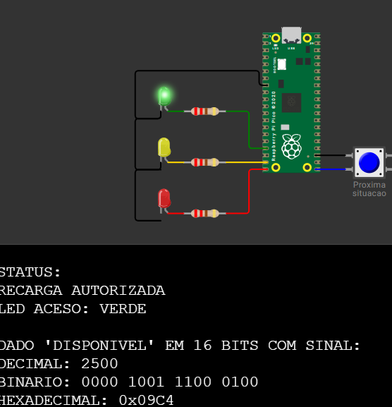
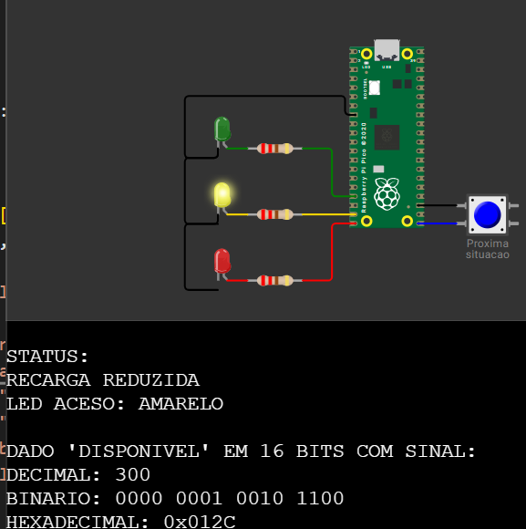
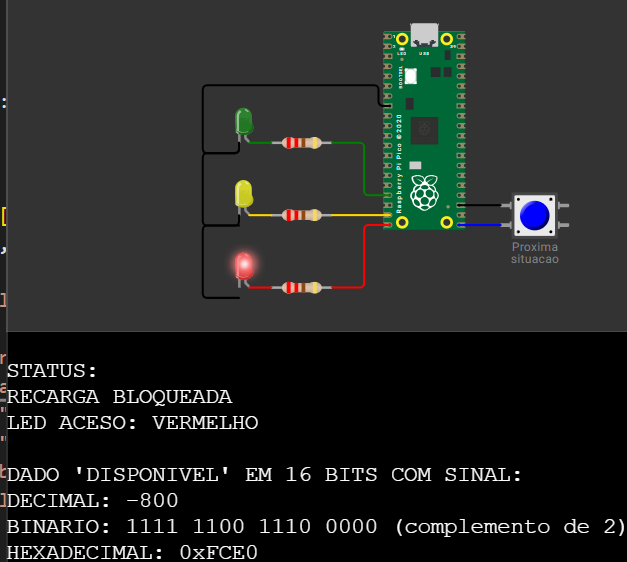

# ChargeGrid — Sprint 3: Controle Inteligente de Sessão de Recarga

Protótipo de um controlador de sessão de recarga para veículos elétricos, feito no **Raspberry Pi Pico (RP2040)** com **MicroPython** e simulado no **Wokwi**.

O sistema compara a **geração** de energia com o **consumo** da residência e decide se a recarga do veículo pode acontecer, sinalizando o resultado em três LEDs e no Monitor Serial. A ideia é inspirada no conceito do **GoodWe Smart Energy Controller**: o carregador só usa a energia que sobra depois de atender a casa.

- **Disciplina:** Arquitetura de Computadores — FIAP
- **Plataforma:** Raspberry Pi Pico + MicroPython (Wokwi)
- **Integrantes:** _(preencher)_
- **Link do projeto no Wokwi:** _(preencher)_

---

## 1. Arquivos do projeto

| Arquivo | Descrição |
|---|---|
| `main.py` | Código MicroPython que roda na Pico |
| `diagram.json` | Esquema de componentes e ligações do Wokwi |
| `imagens/` | Prints das três situações em funcionamento |

---

## 2. Componentes e ligações

| Componente | Pino da Pico | Função |
|---|---|---|
| LED verde + resistor 220 Ω | GP13 | Recarga autorizada |
| LED amarelo + resistor 220 Ω | GP14 | Recarga reduzida |
| LED vermelho + resistor 220 Ω | GP15 | Recarga bloqueada |
| Botão (outro contato no GND) | GP16 | Avança para a próxima situação |
| Catodos dos três LEDs | GND | Retorno comum |

O botão usa o **resistor de pull-up interno** da Pico: solto o pino lê `1`, pressionado lê `0`.

---

## 3. Como executar no Wokwi

1. Abrir `wokwi.com/projects/new/micropython-pi-pico` (template de MicroPython na Pico).
2. Na aba `diagram.json`, selecionar tudo (Ctrl+A) e colar o conteúdo do `diagram.json` deste repositório.
3. Na aba `main.py`, selecionar tudo e colar o conteúdo do `main.py`.
4. Clicar no botão play verde. O Monitor Serial abre junto com a simulação e já mostra a Situação 1.
5. Clicar no botão azul do diagrama para passar para a próxima situação (1 → 2 → 3 → 1 …).

---

## 4. Como o sistema funciona

O programa repete um ciclo clássico de entrada → processamento → saída, usando a memória para guardar os dados de cada situação:

```
ENTRADA          PROCESSAMENTO              SAÍDA
botão (GP16) --> disponível = geração   --> LEDs (GP13/GP14/GP15)
                              - consumo     Monitor Serial
                 comparação com os limites
      ^                    |
      |                    |
   MEMÓRIA: tabela SITUACOES (geração e consumo de cada caso)
```

### 4.1 Dados de cada situação

Ficam guardados em memória, na tupla `SITUACOES`:

| Situação | Geração | Consumo |
|---|---|---|
| 1 — Energia suficiente | 4000 W | 1500 W |
| 2 — Energia limitada | 1800 W | 1500 W |
| 3 — Energia insuficiente | 1000 W | 1800 W |

### 4.2 Cálculo

```
energia disponível = geração − consumo
```

A potência liberada para o carregador é esse excedente, limitado à potência nominal do carregador (`POTENCIA_CARREGADOR_W = 2000 W`).

### 4.3 Regra de decisão

| Energia disponível | Estado | LED aceso | Liberado para recarga |
|---|---|---|---|
| ≥ 2000 W | RECARGA AUTORIZADA | Verde | 2000 W (potência total) |
| de 1 W a 1999 W | RECARGA REDUZIDA | Amarelo | igual ao excedente |
| ≤ 0 W | RECARGA BLOQUEADA | Vermelho | 0 W |

O valor de 2000 W representa a potência nominal do carregador: é o excedente necessário para carregar em potência total e também o máximo que o carregador consegue puxar. Está numa constante única no início do `main.py`, fácil de ajustar.

### 4.4 Tratamento da entrada (botão)

O contato mecânico do botão treme ao ser pressionado (*bouncing*), gerando dezenas de transições em ~1 ms. A função `botao_clicado()` filtra isso: ao detectar nível baixo, espera 30 ms, confirma que continua pressionado e só conta o clique depois que o botão é solto. Assim cada clique avança exatamente uma situação.

---

## 5. Provas de funcionamento

As três situações obrigatórias, simuladas no Wokwi.

### Situação 1 — Energia suficiente → RECARGA AUTORIZADA (LED verde)

Geração 4000 W, consumo 1500 W, disponível 2500 W.



### Situação 2 — Energia limitada → RECARGA REDUZIDA (LED amarelo)

Geração 1800 W, consumo 1500 W, disponível 300 W.



### Situação 3 — Energia insuficiente → RECARGA BLOQUEADA (LED vermelho)

Geração 1000 W, consumo 1800 W, disponível −800 W.



### Saída completa no Monitor Serial (exemplo da Situação 3)

```
========================================
SITUACAO 3 - ENERGIA INSUFICIENTE
========================================
GERACAO: 1000 W
CONSUMO: 1800 W
DISPONIVEL: -800 W
LIBERADO P/ RECARGA: 0 W de 2000 W

STATUS:
RECARGA BLOQUEADA
LED ACESO: VERMELHO

DADO 'DISPONIVEL' EM 16 BITS COM SINAL:
DECIMAL: -800
BINARIO: 1111 1100 1110 0000 (complemento de 2)
HEXADECIMAL: 0xFCE0
```

---

## 6. Representação de dados

O dado escolhido para demonstrar a representação é a **energia disponível**, tratada como um inteiro de **16 bits com sinal** (faixa de −32768 a 32767 W, suficiente para uma residência; 8 bits não caberiam os 2500 W da Situação 1).

| Situação | Decimal | Binário (16 bits) | Hexadecimal |
|---|---|---|---|
| 1 | 2500 | `0000 1001 1100 0100` | `0x09C4` |
| 2 | 300 | `0000 0001 0010 1100` | `0x012C` |
| 3 | −800 | `1111 1100 1110 0000` | `0xFCE0` |

Como é feito no código:

```python
def binario_16(valor):
    bits = "{:016b}".format(valor & 0xFFFF)
    return " ".join(bits[i:i + 4] for i in range(0, 16, 4))
```

A máscara `& 0xFFFF` mantém apenas os 16 bits que um registrador dessa largura guardaria. Por isso o valor negativo da Situação 3 aparece em **complemento de dois**: −800 vira `0xFCE0`, que é `0x10000 − 0x0320`. Conferindo: 800 em binário é `0000 0011 0010 0000`; invertendo todos os bits e somando 1 chega-se a `1111 1100 1110 0000`.

Cada grupo de 4 bits (*nibble*) corresponde a um dígito hexadecimal — é por isso que os números binários são exibidos separados de 4 em 4.

---

## 7. Relação com os conteúdos da disciplina

| Conteúdo | Onde aparece no protótipo |
|---|---|
| Sistemas numéricos | Mesmo valor mostrado em decimal, binário e hexadecimal a cada situação |
| Representação de dados | Inteiro de 16 bits com sinal, complemento de dois para valores negativos, máscara `& 0xFFFF` |
| Processadores | O RP2040 executa a subtração (geração − consumo) e as comparações que decidem o estado |
| Memória | A tupla `SITUACOES` guarda os dados dos três casos e o índice da situação atual fica em variável na RAM |
| Sistemas de entrada e saída (E/S) | Entrada digital pelo botão no GP16 com pull-up interno; saída digital nos LEDs (GP13/GP14/GP15) e saída serial pela USB no Monitor Serial |

---

## 8. Decisões de projeto

- **Dados simulados.** O enunciado permite receber ou simular os valores. A tabela fixa garante que as três situações apresentem exatamente os valores do enunciado durante a avaliação, e o botão entra como dispositivo de entrada real para demonstrar o conceito de E/S.
- **Limite de 2000 W entre verde e amarelo.** O enunciado define apenas os exemplos (2500 W autorizada, 300 W reduzida, −800 W bloqueada); 2000 W foi adotado como potência nominal do carregador, dentro dessa faixa.
- **Zero é bloqueio.** Sem excedente (disponível ≤ 0) não há energia sobrando para a recarga, então o estado é bloqueada.
